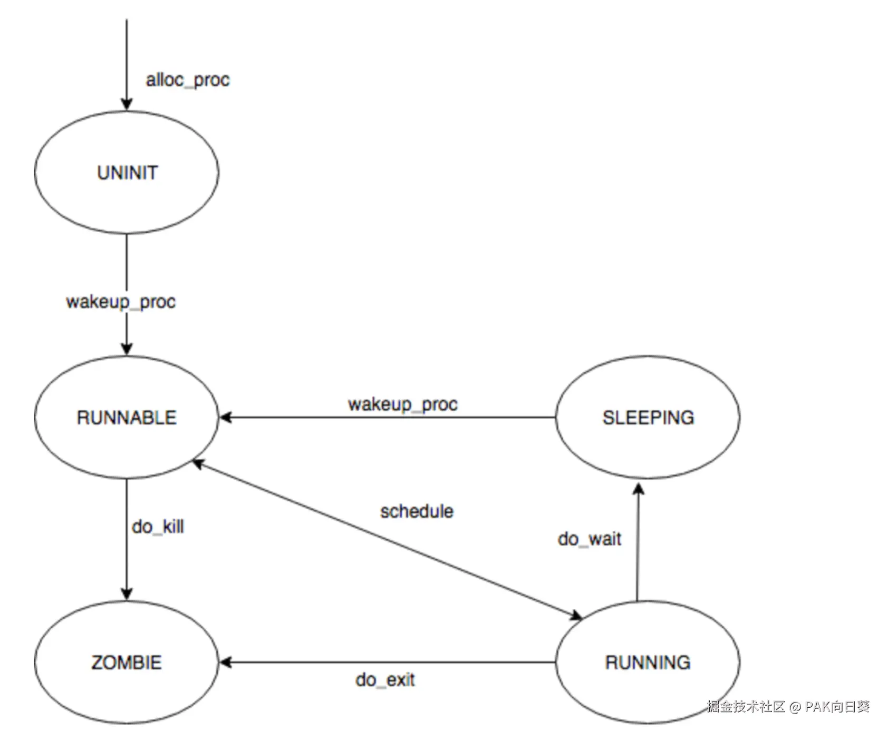

lab5的必做实验部分也是非常简单的。

# 练习0：填写已有实验

为了顺利开展lab5，我们除了需要将之前几个lab的代码迁移过来，还需要对先前实验的部分源码进行修改。

`alloc_proc`函数要初始化PCB结构体中新增的三个字段：

```C++
static struct proc_struct *
alloc_proc(void) {
    struct proc_struct *proc = kmalloc(sizeof(struct proc_struct));
    if (proc != NULL) {
        
        // 略...
        
        //LAB5 YOUR CODE : (update LAB4 steps)
        proc->cptr = proc->yptr = proc->optr = NULL;
        proc->wait_state = 0;
    }
    return proc;
}
```

`do_fork`函数也要进行微调：

```C++
int
do_fork(uint32_t clone_flags, uintptr_t stack, struct trapframe *tf) {
    
    // 略...

    //    1. call alloc_proc to allocate a proc_struct
    struct proc_struct* child_proc = alloc_proc();
    if (child_proc == NULL) {
        goto fork_out;
    }
    // update step 1: set child proc's parent to current process, make sure current process's wait_state is 0
    child_proc->parent = current;
    assert(current->wait_state == 0);
    
    // 略...
    
    //    5. insert proc_struct into hash_list && proc_list
    bool intr = 0;
    local_intr_save(intr);
    {
        child_proc->pid = get_pid();
        hash_proc(child_proc);
        // update step 5: insert proc_struct into hash_list && proc_list
        // set the relation links of process
        set_links(child_proc);
    }
    local_intr_restore(intr);

    // 略...

}
```

从lab5开始由于正式引入了系统调用机制，我们还需要添加系统调用的陷进门：

```C++
void idt_init(void) {
    extern uint32_t __vectors[];
    for (int i = 0; i < sizeof(idt) / sizeof(struct gatedesc); ++i) {
        SETGATE(idt[i], 0, GD_KTEXT, __vectors[i], DPL_KERNEL);
    }
    SETGATE(idt[T_SWITCH_TOK], 0, GD_KTEXT, __vectors[T_SWITCH_TOK], DPL_USER);
    /* LAB5 YOUR CODE */ 
    SETGATE(idt[T_SYSCALL], 1, GD_KTEXT, __vectors[T_SYSCALL], DPL_USER);
    lidt(&idt_pd);
}
```

此外，从lab5开始支持计算机硬件通过时钟中断来驱动进程调度，所以我们还需要修改函数`trap_dispatch`，使得在时钟中断到来时中断服务程序能够将当前正在执行的进程标记为"准备将CPU让给其他进程执行"：

```C++
static void
trap_dispatch(struct trapframe *tf) {
    char c;
    int ret=0;
    switch (tf->tf_trapno) {
        //略...
        case IRQ_OFFSET + IRQ_TIMER:        
            /* LAB5 YOUR CODE */
            if (++ticks % TICK_NUM == 0) {
                ticks = 0;
                assert(current != NULL);
                current->need_resched = 1;
            }
            break;
        //略...
    }
}
```

# 练习1: 加载应用程序并执行

## 代码实现

代码非常简单，我们只需要添加几行代码就行了：

```C++
static int
load_icode(unsigned char *binary, size_t size) {

    // 略...

    //(6) setup trapframe for user environment
    struct trapframe *tf = current->tf;
    memset(tf, 0, sizeof(struct trapframe));
    tf->tf_cs = USER_CS;
    tf->tf_ds = tf->tf_es = tf->tf_ss = USER_DS;
    tf->tf_esp = USTACKTOP;
    tf->tf_eip = elf->e_entry;
    tf->tf_eflags |= FL_IF;

    ret = 0;

    // 略...

}
```

## 当创建一个用户态进程并加载了应用程序后，CPU是如何让这个应用程序最终在用户态执行起来的？

故事仍然从操作系统内核入口函数`kern_init`开始讲起。在该函数中会先后调用`proc_init`和`cpu_idle`函数。

在`proc_init`函数中会初始化天字一号内核进程`init`（对应函数`init_main`），并将其放入进程链表`proc_list`中，且进程状态标记为`PROC_RUNNABLE`。

接下来CPU执行到`cpu_idle`函数，该函数又会进一步调用`schedule`这个uCore中进行进程调度的关键函数。`schedule`函数会从进程链表中挑选出内核进程`init`，并进一步通过`proc_run`函数跳转到`init_main`函数。这个过程实际上就是内核进程之间的切换过程，我们已经在lab4中探讨过了，这里不再赘述其中的细节。

至此启动首个用户进程这场接力赛就交棒给了我们的天字一号内核进程了，让我们重点看看它会做什么：

```C++
static int
init_main(void *arg) {
    // ...
    int pid = kernel_thread(user_main, NULL, 0);
    if (pid <= 0) {
        panic("create user_main failed.\n");
    }

    while (do_wait(0, NULL) == 0) {
        schedule();
    }

    cprintf("all user-mode processes have quit.\n");
    // ...
}
```

可见天字一号进程仍然会调用`kernel_thread`再新创建了一个内核进程。为了方便，我们称它为FirstUser进程。从这个名字就可以猜到，在接下来的分析过程中，我们将看到这个FirstUser内核进程是如何完成华丽转身，变成第一个用户进程的。

紧接着天字一号进程调用`do_wait`函数。这里我们暂时不深究`do_wait`当中的实现细节，只需要大致知道该函数会使得天字一号进程的状态切换为`PROC_SLEEPING`，然后调用`schedule`函数将CPU的控制权转移给其他进程继续执行。

由于现在我们的进程链表中只有天字一号内核进程和新创建的FirstUser内核进程，通过对`schedule`函数的简单分析可知接下来它会调度FirstUser进程来执行，即接下来CPU将会跳到`user_main`函数继续执行：

```C++
// user_main - kernel thread used to exec a user program
static int
user_main(void *arg) {
#ifdef TEST
    KERNEL_EXECVE2(TEST, TESTSTART, TESTSIZE);  // make grade用，这里我们暂时不管
#else
    KERNEL_EXECVE(exit);
#endif
    panic("user_main execve failed.\n");
}
```

大概看一下，我们应该能够猜到默认情况下在qemu中调试lab5的源码，`user_main`函数会拉起一个名为`exit`。这里的`KERNEL_EXECVE(exit)`实际上是一个宏，让我们把它展开，并调整一下代码排版：

```C++
static int user_main(void *arg) {
    extern unsigned char _binary_obj___user_exit_out_start[];
    extern unsigned char _binary_obj___user_exit_out_size[]; 
    cprintf("kernel_execve: pid = %d, name = \"%s\".\n", current->pid, "exit");
    kernel_execve("exit", 
                  _binary_obj___user_exit_out_start, 
                  (size_t)(_binary_obj___user_exit_out_size)
    );
}
```

这又是什么玩意呢？阅读uCore官方文档可知，由于lab5中uCore还没有建立文件系统，不方便像真正的操作系统那样从硬盘上读取ELF格式的用户应用程序，因此采用了直接将用户程序的ELF文件二进制数据硬编码到编译uCore所得的`bin/kernel`文件当中的临时策略。这样我们的bootloader在加载硬盘上的uCore内核到物理内存中时，也能够顺带着把用户应用程序的ELF二进制数据一起加载进来。

这里由于时间原因，我不会去讨论编译用户应用程序，以及内嵌到kernel文件中的这些构建操作在uCore中是怎么设置的，如感兴趣可参考[官方文档](https://chyyuu.gitbooks.io/ucore_os_docs/content/lab5/lab5_3_2_create_user_process.html)。

在lab5中，我们只需要知道编译器提供的外部变量`_binary_obj___user_exit_out_start`表示ELF格式的用户应用程序在内核虚拟内存空间中的首地址；外部变量`_binary_obj___user_exit_out_size`表示ELF格式的用户应用程序的文件大小（单位字节）。

接下来终于要开始激动人心的拉起用户应用程序执行阶段了，让我们先看一眼这个`kernel_execve`函数：

```C++
static int
kernel_execve(const char *name, unsigned char *binary, size_t size) {
    int ret, len = strlen(name);
    asm volatile (
        "int %1;"
        : "=a" (ret)
        : "i" (T_SYSCALL), "0" (SYS_exec), "d" (name), "c" (len), "b" (binary), "D" (size)
        : "memory");
    return ret;
}
```

可以看到这个函数会触发一个T\_SYSCALL软中断，并将系统调用号（SYS\_exec）放入eax寄存器，各个参数依次放入edx、ecx、ebx和edx这几个通用寄存器。这与`kern/syscall/syscall.c`中负责派发系统调用软中断的`syscall`函数中的代码实现是一一对应的：

```C++
void
syscall(void) {
    struct trapframe *tf = current->tf;
    uint32_t arg[5];
    int num = tf->tf_regs.reg_eax;
    if (num >= 0 && num < NUM_SYSCALLS) {
        if (syscalls[num] != NULL) {
            arg[0] = tf->tf_regs.reg_edx;
            arg[1] = tf->tf_regs.reg_ecx;
            arg[2] = tf->tf_regs.reg_ebx;
            arg[3] = tf->tf_regs.reg_edi;
            arg[4] = tf->tf_regs.reg_esi;
            tf->tf_regs.reg_eax = syscalls[num](arg);
            return ;
        }
    }
    print_trapframe(tf);
    panic("undefined syscall %d, pid = %d, name = %s.\n",
            num, current->pid, current->name);
}
```

接下来，在`kern/syscall/syscall.c`中，我们知道这个软中断实际上会执行系统调用`sys_exec`，而该函数又会进一步调用内核函数`do_execve`。显而易见的是，后者中包括了实际实现拉起用户程序的核心代码：

```C++
static int
sys_exec(uint32_t arg[]) {
    const char *name = (const char *)arg[0];
    size_t len = (size_t)arg[1];
    unsigned char *binary = (unsigned char *)arg[2];
    size_t size = (size_t)arg[3];
    return do_execve(name, len, binary, size);
}

static int (*syscalls[])(uint32_t arg[]) = {
    // ...
    [SYS_exec]              sys_exec,
    // ...
};
```

这里有个问题，为啥我们要大费周章地在`user_main`函数中（此时CPU仍然处于内核态）去触发软中断呢？直接调用一下内核函数`do_execve`不就得了嘛？你可以先思考一下。

接下来继续往下分析。

实际上内核函数`do_execve`干的最核心的事情不多，主要就两件：

*   在拉起用户程序后，原先操作系统为当前进程虚拟内存空间分配的物理页（还有二级页表）就没用了，要把它们释放掉。
*   读取并解析用户程序的ELF文件数据，为当前进程重新设置虚拟内存空间（申请物理页、配置二级页表...），然后当前进程跳转到用户程序的入口执行。

```C++
int do_execve(const char *name, size_t len, unsigned char *binary, size_t size) {
    struct mm_struct *mm = current->mm;
    // ...
    if (mm != NULL) {
        lcr3(boot_cr3);
        if (mm_count_dec(mm) == 0) {
            exit_mmap(mm);
            put_pgdir(mm);
            mm_destroy(mm);
        }
        current->mm = NULL;
    }
    int ret;
    if ((ret = load_icode(binary, size)) != 0) {
        goto execve_exit;
    }
    // ...
}
```

我们先来看它是如何完成第一件事情的。

首先我们明确一点：操作系统在处理系统调用时，要怎么知道是哪个进程发出的系统调用请求呢？在uCore中，这是通过定义在`kern/process/proc.c`中的全局变量`struct proc_struct *current`来实现的。在`proc_run`函数中进行进程切换前，都会修改这个全局变量，使其指向将要切换到的那个进程的PCB块。这很简单，我就不多说了。

我们又知道，在uCore中任何一个独立的内核进程/用户进程都拥有自己的一个内存描述符（`struct mm`），其中记录了当前进程的页表目录，以及操作系统为进程分配的大块虚拟内存的元信息（`struct vma`）。透过内存描述符我们可以有效管理每个进程的虚拟内存空间，这就是为什么上边的代码中出现了那么多"mm"的原因。

由于时间关系我不会细致地分析上面这段代码中出现的每一个函数的具体实现，我们只需要大致知道它们干了什么就行：

*   `lcr3(boot_cr3)`：因为接下来要回收当前进程正在使用的包括用户虚拟内存空间的二级页表，我们要先把CPU正在使用的二级页表换成仅含有内核虚拟内存空间的内核页表。
*   `mm_count_dec(mm)`：减少当前进程所使用的内存描述符的引用计数。如果引用计数清零，则需要回收该内存描述符对应的用户虚拟内存空间。
*   `exit_mmap(mm)`：回收所有二级页表映射到的物理页，以及所有的储存直接页表的物理页。
*   `put_pgdir(mm)`：回收储存页表目录的物理页。
*   `mm_destroy(mm)`：回收当前进程的内存描述符以及所有的vma结构体。

当然这里需要指出的是，作为内核进程，实际上uCore并不会为其分配内存描述符，所以if块里的这段代码在创建首个用户进程的时候并不会执行。

接下来程序调用最核心的`load_icode`来实现对ELF文件的解析，并初始化用户程序的虚拟内存空间。通过这个函数，我们能够在真正的意义上将我们的内核进程FirstUser转变为首个用户进程。虽然这个函数比较长，但实际上关于"如何解析ELF文件"这个核心问题在lab1中已经探讨过了，另外uCore官方也在代码注释中详细给出了该函数的核心操作。

同样，在lab5中我们只需要大概知道这些核心操作就行了，暂时不必深究代码的实现细节：

*   (1) create a new mm for current process
*   (2) create a new PDT, and mm->pgdir= kernel virtual addr of PDT
*   (3) copy TEXT/DATA section, build BSS parts in binary to memory space of process
*   (3.1) get the file header of the bianry program (ELF format)
*   (3.2) get the entry of the program section headers of the bianry program (ELF format)
*   (3.3) This program is valid?
*   (3.4) find every program section headers
*   (3.5) call mm\_map fun to setup the new vma ( ph->p\_va, ph->p\_memsz)
*   (3.6) alloc memory, and  copy the contents of every program section (from, from+end) to process's memory (la, la+end)
*   (3.6.1) copy TEXT/DATA section of bianry program
*   (3.6.2) build BSS section of binary program
*   (4) build user stack memory
*   (5) set current process's mm, sr3, and set CR3 reg = physical addr of Page Directory
*   (6) setup trapframe for user environment

这里我们最需要把握的实际上是`load_icode`函数中的最后一步，也就是对当前进程的中断帧进行修改。**通过这一步关键操作，我们可以确保CPU退出中断后可以正确翻转到用户态，并且跳转到用户程序的入口地址来执行**。这部分代码本身就比较简单，有了前面几个lab的基础应该也很容易理解，这里我也不多说了。

此外，看到了最后一步的操作，我们应该也就能够理解前边在`user_main`函数中为什么uCore一定要通过发起系统调用软中断，而不是直接调用`do_execve`或者其他什么内核代码的方式，来拉起用户程序——是的，正是为了利用uCore的中断恢复机制，无需添加任何额外代码地、优雅地完成CPU从内核态到用户态的翻转！

最后我们来看看用户应用程序是怎么跳到众所周知的main函数执行的。

通过查看`tools/user.ld`可知，对于用户应用程序来说，实际上其入口地址（也就是`load_icode`中设定的`elf->e_entry`中断返回地址）并不是我们所熟知的main函数，而是一个叫`_start`的地方，其实现代码位于`user/libs/initcode.S`。这是一段非常简单的汇编代码:

```assembler
.text
.globl _start
_start:
    # set ebp for backtrace
    movl $0x0, %ebp

    # move down the esp register
    # since it may cause page fault in backtrace
    subl $0x20, %esp

    # call user-program function
    call umain
1:  jmp 1b
```

*   `movl $0x0, %ebp`：将栈基址寄存器值设成0，表示对于用户程序来说，`_start`中的代码为函数调用栈的底部，再往下就追溯不下去了。这步操作应该为了方便后续对用户程序进行调试。
*   `subl $0x20, %esp`：实际上我们在`load_icode`函数里设置的"将中断返回后的%esp设成`USTACKTOP`"是有点问题的——实际上`USTACKTOP=0xB0000000`这个虚拟地址是没有包括在`load_icode`为进程分配的堆栈空间之内的。因此这里将栈顶指针适当下移一点，确保它指在堆栈空间的虚拟地址范围之内，以避免潜在的缺页异常。
*   `call umain`：跳到`umain`函数继续执行。
*   `jmp 1b`：正常情况下，这条代码永远不会执行。

`umain`函数位于`user/libs/umain.c`，内容就更加简陋了。从该函数中可知，用户应用程序的入口函数`int main()`执行完毕并返回后，会把返回值传递给一个叫`exit`的函数。经过进一步分析可知，该函数会触发系统调用`SYS_exit`，最终导致内核中的`do_exit`函数被执行。关于`do_exit`函数，我们后面再详细分析，这里只要知道它会将当前进程标记为僵尸进程（`PROC_ZOMBIE`），并且回收为该进程分配的物理页，并将CPU控制权出让给其他可供调度的进程就行了。

```C++
#include <ulib.h>

int main(void);

void
umain(void) {
    int ret = main();
    exit(ret);
}
```

到此为止，第一个用户进程从创建到运行的全过程，就分析地差不多啦！

# 练习2: 父进程复制自己的内存空间给子进程

## 代码实现

代码仍然非常简单，我们只需要添加最后的那几行代码就行了：

```C++
int
copy_range(pde_t *to, pde_t *from, uintptr_t start, uintptr_t end, bool share) {
    assert(start % PGSIZE == 0 && end % PGSIZE == 0);
    assert(USER_ACCESS(start, end));
    // copy content by page unit.
    do {
        //call get_pte to find process A's pte according to the addr start
        pte_t *ptep = get_pte(from, start, 0), *nptep;
        if (ptep == NULL) {
            start = ROUNDDOWN(start + PTSIZE, PTSIZE);
            continue ;
        }
        //call get_pte to find process B's pte according to the addr start. If pte is NULL, just alloc a PT
        if (*ptep & PTE_P) {
            if ((nptep = get_pte(to, start, 1)) == NULL) {
                return -E_NO_MEM;
            }
            uint32_t perm = (*ptep & PTE_USER);
            //get page from ptep
            struct Page *page = pte2page(*ptep);
            // alloc a page for process B
            struct Page *npage=alloc_page();
            assert(page!=NULL);
            assert(npage!=NULL);
            int ret=0;
            /* LAB5:EXERCISE2 YOUR CODE*/
            // (1) find src_kvaddr: the kernel virtual address of page
            void* src_kvaddr = page2kva(page);
            // (2) find dst_kvaddr: the kernel virtual address of npage
            void* dst_kvaddr = page2kva(npage);
            // (3) memory copy from src_kvaddr to dst_kvaddr, size is PGSIZE
            memcpy(dst_kvaddr, src_kvaddr, PGSIZE);
            // (4) build the map of phy addr of  nage with the linear addr start
            ret = page_insert(to, npage, start, perm);
            assert(ret == 0);
        }
        start += PGSIZE;
    } while (start != 0 && start < end);
    return 0;
}
```

# 练习3: 阅读分析源代码，理解进程执行 fork/wait/exit 的实现

## 准备工作

### 理解uCore如何管理一个进程的所有子进程

我们知道在lab5中为进程PCB块添加了三个新的`struct proc_struct*`类型的字段`yptr`、`optr`和`cptr`，PCB块初始化时它们的初值都为NULL。实际上它们的完整名称分别应该叫做`younger pointer`、`older pointer`和`current pointer`，不过这又表示什么意思呢？

来来来，看张图你就懂了：

```text
                     +----------------+
                     | parent process |
                     +----------------+
              parent ^         \       ^  parent
                    /           \       \
                   /             \ cptr  \
                  /         yptr  V       \      yptr
           +-------------+  -->  +-------------+  -->  NULL
           | old process |       | New Process |
NULL  <--  +-------------+  <--  +-------------+
      optr                  optr
      
本图出处https://juejin.cn/post/7134991238025084936
```

由图可见：

*   依靠`yptr`和`optr`指针构成了一个双向链表，将同属于一个父进程的所有子进程"串"起来。
*   父进程的`cptr`指针指向最迟被创建出来的那个子进程。
*   所有子进程的`parent`指针都指向父进程。

通过这种巧妙的设计（uCore源码注释中称为"relation link"），在uCore内我们可以很方便地将某个父进程的所有子进程管理起来，并以遍历链表的形式可以访问到所有的子进程。

我们还可以再看看lab5中改进后的`set_links`和`remove_links`函数，以加深对这个设计的理解：

```C++
// set_links - set the relation links of process
static void
set_links(struct proc_struct *proc) {
    list_add(&proc_list, &(proc->list_link));
    proc->yptr = NULL;
    if ((proc->optr = proc->parent->cptr) != NULL) {
        proc->optr->yptr = proc;
    }
    proc->parent->cptr = proc;
    nr_process ++;
}

// remove_links - clean the relation links of process
static void
remove_links(struct proc_struct *proc) {
    list_del(&(proc->list_link));
    if (proc->optr != NULL) {
        proc->optr->yptr = proc->yptr;
    }
    if (proc->yptr != NULL) {
        proc->yptr->optr = proc->optr;
    }
    else {
       proc->parent->cptr = proc->optr;
    }
    nr_process --;
}
```

## exit

我们先来分析最简单的`SYS_exit`系统调用实现。首先，`kern/syscall/syscall.c`中的封装是没什么好讲的地方的。

```C++
static int sys_exit(uint32_t arg[]) {
    int error_code = (int)arg[0];
    return do_exit(error_code);
}
```

根据源码中的注释，我们知道`do_exit`会做以下几件事：

1.  call exit\_mmap & put\_pgdir & mm\_destroy to free the almost all memory space of process
2.  set process' state as PROC\_ZOMBIE,
3.  then call wakeup\_proc(parent) to ask parent reclaim itself.
4.  call scheduler to switch to other process

第一件事是回收物理页和二级页表，自然没什么好说的，这与`do_execve`中的实现是一样的。

> 不过这里需要特别注意一点，当前进程的内核栈（`kstack`）和PCB块在这里并不会被回收。为什么呢？
>
> 对于前者，你可别忘了目前`do_exit`内核代码是依赖当前进程的内核栈在执行的，当然不能回收。对于后者，我们还有一些针对目前进程的信息还需要记录，你看看`do_exit`函数要做的第二件事就知道了，所以现在还不是释放PCB块的时候。

> 你可能又会问，在执行`exit_mmap`函数的时候为什么不会把当前进程内核栈对应的物理页给释放掉呢？
>
> 实际上如果你仔细看看`setup_kstack`函数，就会知道一个进程的内核栈是老老实实呆在虚拟内存空间中的内核区域的，而进程的内存描述符中当然不可能包括内核区域的元信息，这就保证了内核栈不会被`exit_mmap`函数回收。

第二件事其实注释说的不完全，实际上内核还会把用户程序`int main()`的返回值给保存到PCB块里去——很好，现在我们总算知道main函数的返回值上哪儿去了。

```C++
    current->state = PROC_ZOMBIE;
    current->exit_code = error_code;
```

第三件事的代码似乎有点复杂，不过只要我们理解了上面提到的所谓"relation link"，应该还是不难的：

```C++
    bool intr_flag;
    struct proc_struct *proc;
    // 修改"子进程链表"的过程中，我们不允许发生中断，否则引起的调度可能会导致意外
    local_intr_save(intr_flag);
    {
        // 如果当前进程的父进程正在等待子进程执行完毕，
        // 则"唤醒"父进程
        proc = current->parent;
        if (proc->wait_state == WT_CHILD) {
            wakeup_proc(proc);
        }
        
        while (current->cptr != NULL) {
            // 从当前进程的"子进程链表"中取出最后一个子进程
            proc = current->cptr;
            current->cptr = proc->optr;
            proc->yptr = NULL;
            // 将这个子进程添加到天字一号进程的"子进程链表"，变成它的子进程
            if ((proc->optr = initproc->cptr) != NULL) {
                initproc->cptr->yptr = proc;
            }
            proc->parent = initproc;
            initproc->cptr = proc;
            // 如果这个子进程是个僵尸进程，并且天字一号进程正在自旋等待子进程结束，
            // 那么就"唤醒"天字一号进程，即将其状态标记为PROC_RUNNABLE，允许接下来被操作系统调度.
            if (proc->state == PROC_ZOMBIE) {
                if (initproc->wait_state == WT_CHILD) {
                    wakeup_proc(initproc);
                }
            }
        }
    }
    local_intr_restore(intr_flag);
```

第四件事应该也不难理解。现在当前进程已经被标记成了僵尸进程，而在lab5当中只有状态为`PROC_RUNNABLE`的进程才会被操作系统调度，因此接下去随着当前进程调用`schedule`函数让出CPU使用权，它将彻底处于"僵死"状态，再也不能被重新调度起来继续执行了。

## fork

`do_fork`函数在lab4中我们就已经接触过了，而在lab5中又加入了完整的`SYS_fork`系统调用实现。由于绝大部分内容我们在上一个lab中就已经非常熟悉了，这里我只挑一个我认为比较重要的点来谈一谈。

[《给操作系统捋条线》](https://github.com/Rand312/xv6)的作者曾提过："**我一直认为，操作系统能把栈捋清楚那基本就没什么问题了。**"

**我认为这句话说的很对。** 而在`SYS_fork`系统调用的实现中，也包含着一些有关栈的细节值得我们注意。

在上一个实验中，被`do_fork`函数调用的`copy_thread`函数中的几句代码或许仍然让你感到疑惑。在这个函数中，有两处与`%esp`指针有关的代码——`proc->tf->tf_esp = esp`和`proc->context.esp = (uintptr_t)(proc->tf)`。该如何理解它们两个的区别呢？这在lab4中似乎并不是很明朗，但现在有了实现系统调用的`sys_fork`函数，理解起来就比较容易了。

通过分析`sys_fork`的代码，我们知道`proc->tf->tf_esp = esp`中的`esp`指的其实是父进程请求`SYS_fork`系统中断那一瞬间，父进程的`%esp`指针的值——它被x86硬件记录在父进程的中断帧中。

我们已经从上一个lab中知道，被fork出来的子进程在被操作系统调度后首先会跳到`forkret`函数执行，而后最终抵达`kern/trap/trapentry.S`中的`__trapret`代码块，并以子进程自己PCB块中`struct trapframe *tf`指针所指的trapframe作为CPU恢复中断现场所使用的中断帧，执行`iret`指令使得CPU"恢复现场"（实际上将子进程的执行上下文变成和父进程一样）并回到用户态，以继续执行子进程自己的用户代码。

也就是说，在子进程回到用户代码的那一瞬间，它的`%esp`指针的值应该和父进程执行`fork()`函数请求系统调用那一瞬间父进程自己的`%esp`指针的值是一样的——这显然本就是`SYS_fork`系统调用理应达到的效果！

ok，现在我们再来看看`proc->context.eip = (uintptr_t)forkret`又干了什么。

正如我们阅读源码后所知道的，被fork出来的子进程在被调度后是不可能直接"嗖的一下"进入用户代码继续执行的。它必须先在操作系统内核中经历一些流程，再最后通过`iret`指令"恢复现场"才能回到用户代码——也就是uCore里边的`switch_to=>forkret=>forkrets=>__trapret`这套东西。

那么既然子进程在最初被调度后还要跑一些内核代码，我们就必须为子进程提供一个内核栈来支撑这些内核代码的运行。而你应该还记得，在`do_fork`函数中我们事先已经通过`setup_kstack`为fork出来的子进程创建好内核栈了。所以现在我们只需要确保子进程被调度后，CPU的栈顶寄存器能指向它的内核栈（通过`switch_to`函数实现）。

因此我们要做的很简单，把子进程的执行上下文给设置好就行了，这就是`proc->context.esp = (uintptr_t)(proc->tf)`这一条代码的由来——这很容易理解，对吧？

注意，由于内核栈的底端（地址最高处）已经被我们用来放置为子进程"恢复中断现场"用的中断帧了（正如`copy_thread`函数的前两行所述），所以在子进程被调度后，它的`%esp`指针应该指向我们构造出来的这个中断帧的下方（低地址处），而不能直接指向内核栈的底端！

另外需要注意的是，在这里内核栈的作用仅仅维持到`iret`指令被调用那一刻。接下来由于CPU发生了从内核态到用户态的翻转，其`%esp`寄存器会被"恢复"成中断帧中所设置的`tf_esp`。至此子进程的内核栈便深藏功与名，只有等到下一次该进程被中断才能够再次挺身而出。

```C++
// kern/syscall/syscall.c
static int sys_fork(uint32_t arg[]) {
    struct trapframe *tf = current->tf;
    uintptr_t stack = tf->tf_esp;
    return do_fork(0, stack, tf);
}

// kern/process/proc.c
static void copy_thread(struct proc_struct *proc, uintptr_t esp, struct trapframe *tf) {
    proc->tf = (struct trapframe *)(proc->kstack + KSTACKSIZE) - 1;
    *(proc->tf) = *tf;
    proc->tf->tf_regs.reg_eax = 0;
    proc->tf->tf_esp = esp;
    proc->tf->tf_eflags |= FL_IF;

    proc->context.eip = (uintptr_t)forkret;
    proc->context.esp = (uintptr_t)(proc->tf);
}

// kern/process/proc.c
int do_fork(uint32_t clone_flags, uintptr_t stack, struct trapframe *tf) {
    // 略...
    
    //    2. call setup_kstack to allocate a kernel stack for child process
    if (setup_kstack(child_proc) != 0) {
        goto bad_fork_cleanup_proc;
    }
    
    // 略...
    
    //    4. call copy_thread to setup tf & context in proc_struct
    copy_thread(child_proc, stack, tf);
    
    // 略...
}
```

## wait

`SYS_wait`系统调用对应的内核函数为`do_wait(int pid, int *code_store)`。

虽然看上去代码稍微有点长，但实际上它的行为非常容易理解，我想了半天都没有想到值得特别拿出来讲的地方：

*   (1) 如果传入参数为合法的pid，则检查当前进程是否拥有一个进程号为该值的子进程。如有，则进一步判断该进程是不是僵尸子进程。
*   (2) 如果传入参数为pid=0，则在当前进程的"子进程链表"（relation link）中查找当前进程是否拥有一个子进程。如有，则进一步判断该进程是不是僵尸子进程。
*   (3) 如果发现了僵尸子进程，则将其从全体进程链表（`proc_link`）和父进程的"子进程链表"中移除，回收其内核栈和PCB块。函数返回0。
*   (4) 如果发现了符合条件的子进程，但不是（没有找到）僵尸子进程，则当前进程调用`schedule`放弃CPU使用权让给其他进程，同时被标记为`PROC_SLEEPING`，从而使得操作系统无法再次主动调度该进程。回顾一下上面提到的`do_exit`函数实现，我们就能知道在这种情况下要"唤醒"该进程，就只能依赖它的子进程主动执行`SYS_exit`系统调用了。**这就是wait系统调用实现父进程等待子进程执行完毕才会继续往下执行的底层原理！**
*   (5) 如果当前进程在被标记为`PROC_SLEEPING`后被重新唤醒，则重新执行上述的检查步骤。

## 请给出 ucore 中一个用户态进程的执行状态生命周期图

原图出自[这里](https://blog.csdn.net/qq_39480177/article/details/130658752)，我感觉整理的非常好。


